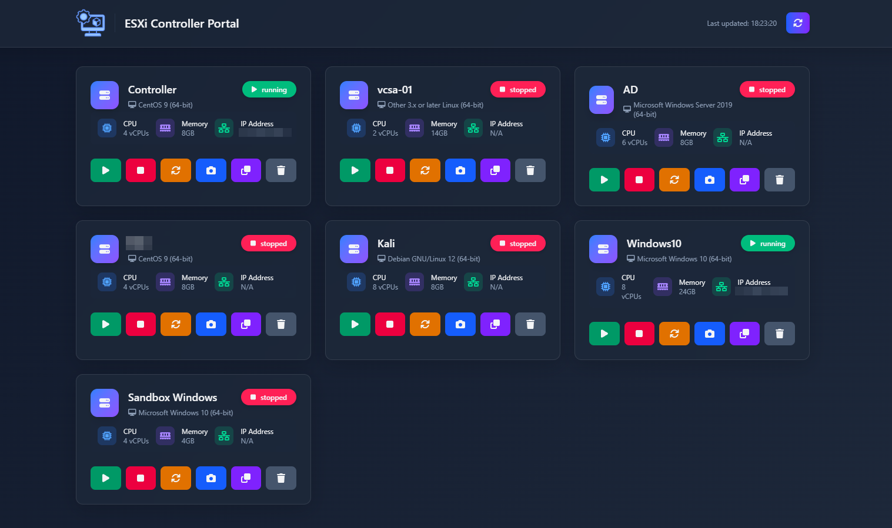

# ESXi Web Manager

A modern web interface for managing VMware ESXi virtual machines with a clean, responsive UI.



## Features

- **VM Management**: Start, stop, reset, clone, and delete virtual machines
- **Real-time Monitoring**: View VM status, specs, and IP addresses
- **VM Screenshots**: Capture and download console screenshots
- **Modern UI**: Clean, responsive interface with glass-morphism design
- **Docker-based**: Easy deployment with Docker Compose

## Requirements

- Docker and Docker Compose
- VMware ESXi host with API access enabled
- Network connectivity to the ESXi host

## Quick Start

1. Clone this repository:
   ```bash
   git clone https://github.com/yourusername/esxi-web-manager.git
   cd esxi-web-manager
   ```

2. Configure your ESXi host details in `docker-compose.yml`:
   ```yaml
   environment:
     - ESXI_HOST=your.esxi.host.ip
     - ESXI_USER=root
     - ESXI_PASSWORD=your_password
   ```

3. (Optional) Set up SSH keys for enhanced VM cloning:
   ```bash
   mkdir -p keys
   ssh-keygen -t rsa -f ./keys/id_rsa -N ""
   ssh-copy-id -i ./keys/id_rsa.pub root@your.esxi.host.ip
   ```

4. Start the application:
   ```bash
   docker-compose up -d
   ```

5. Access the web interface at http://localhost:5656

## Architecture

The application consists of two main components:

- **Backend**: Python FastAPI application that communicates with the ESXi API
- **Frontend**: Single-page web application served by Nginx

## Security Considerations

- This application requires administrative access to your ESXi host
- By default, the web interface has no authentication
- For production use, consider implementing proper authentication/authorization

## Ports

- **5656**: Web interface (frontend)
- **8000**: API server (backend)

## Development

### Backend

The backend is a Python application using FastAPI and pyVmomi:

```bash
cd backend
pip install -r requirements.txt
uvicorn main:app --reload --host 0.0.0.0 --port 8000
```

### Frontend

The frontend is a static HTML/CSS/JS application:

```bash
cd frontend
# Serve with any static file server, e.g.:
python -m http.server 5656
```

## Troubleshooting

- Ensure ESXi host has API access enabled
- Check network connectivity between Docker and ESXi host
- Verify ESXi credentials in docker-compose.yml
- Check Docker container logs for errors:
  ```bash
  docker-compose logs
  ```

## License

This project is licensed under the MIT License - see the LICENSE file for details.
